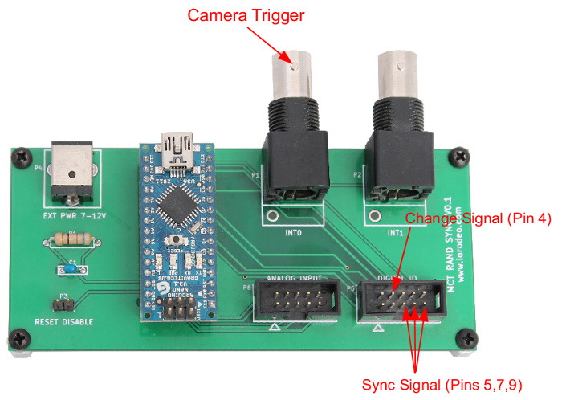

*****************************
Random Synchronization Signal
*****************************

The purpose of the random synchronization hardware is to provide a random 3-bit
signal which can be used to verify the synchronization between the camera
tracking and Neuralynx data. In addition if a misalignment is discovered the
random synchronization signal can be used to help determine where the
misalignment has occurred and to help re-align the data.  

Hardware Description
=====================

The random synchronization hardware is designed as shield for the  `Arduino
Nano. <http://arduino.cc/en/Main/ArduinoBoardNano>`_  

The firmware on the Arduino generates a random 3-bit synchronization signal
which changes value once a second. The random synchronization bits are
output on pins 5,7 and 9 of the Digital IO header. A change signal, which
toggles every time the synchronization signal changes, is output on pin 4. 

A BNC input is provided for the camera trigger signal. A camera trigger on this
input will initiate an interrupt service routine in the firmware.  The
interrupt routine counts the camera trigger, records the state of the random
synchronization signal and save the values in a ring buffer. The MCT master can
then query the random synchronization device, over USB, in order to get the random
synchronization signal associate with a given camera trigger. 

For each camera frame the MCT software will query the random synchronization
device in order to get the associated 3-bit signal so that it can be recorded
along with the tracking data. 

Additional information:

* :download:`Schematic <_static/rand_sync_device_schem.pdf>` and :download:`layout <_static/rand_sync_device_layout.png>`

* Design files and BOM (KiCad) https://bitbucket.org/iorodeo/mct_rand_sync_pcb/src

* Device firmware https://bitbucket.org/iorodeo/mct/src/  (subdirectory: mct_rand_sync/firmware/rand_sync)

Installation/Upgrade
====================

Note, the initial MCT system design did not include the random synchronization
hardware. In order to make use of this this system the MCT software and
configuration needs to be upgraded and the random synchronization hardware
needs to be installed. 

Overview of installation steps:

#. Update MCT software and configuration. 
#. Install the hardware.
#. Test the installation.

Updating the MCT software and configuration files.
~~~~~~~~~~~~~~~~~~~~~~~~~~~~~~~~~~~~~~~~~~~~~~~~~~

Using the random synchronization devices requires upgrades to both the MCT
software and the MCT configuration files.  

The MCT software needs to be upgraded as a new ROS package (mct_rand_sync)  is
required for communicating with the random synchronization hardware. In
addition modified versions of serveral existing MCT ROS packages - such as
mct_logging and mct_web_apps - are required in order to properly add the
synchronization signals to the MCT tracking data.

The MCT configuration files need to be modified as an new rand_sync section
(directory) has been added to the configuration in order to store the required
parameters for communicating with this new hardware.

In what follows it is assumed that the master and slave computers are all
running.  

The first step is to pull the latest versions of the MCT software and MCT
configuration repositories. Two cases are considered: first where the MCT
master has internet access second where it does not.

Pulling latest version with internet access
^^^^^^^^^^^^^^^^^^^^^^^^^^^^^^^^^^^^^^^^^^^^^

On the MCT master computer the following command should be run twice - once
from within the local copy of the  MCT source repository (e.g.  ~/ros/mct) and
a second time from within the local copy of the MCT configuration repository
(e.g. ~/ros/mct_config).

.. code-block:: bash

   # Pull and update mercurial repository  
   hg pull -u

This will update the local copes of the MCT software and configuration to the 
latest version. 

Pulling latest version without internet access
^^^^^^^^^^^^^^^^^^^^^^^^^^^^^^^^^^^^^^^^^^^^^^

If the MCT master does not have internet access copies of the latest versions
of the MCT software and configuration repositories will need to be downloaded
onto a thumb drive (or similar) on a computer with does.

Copies (.zip archives) of the latest versions of the repositories can be
downloaded from here

* MCT software https://bitbucket.org/iorodeo/mct/downloads 

* MCT configuration https://bitbucket.org/iorodeo/mct_config/downloads

Unzip the downloaded archives and place them on a thumbdrive. Then copy them 
to a temporary directory on the MCT master computer (e.g. ~/temp). 

On the MCT master computer the following command should be run twice - once
from within MCT source repository (e.g.  ~/ros/mct) and a second time from
within the local copy of the MCT configuration repository (e.g.
~/ros/mct_config).

.. code-block:: bash

   # Pull and update mercurial repository  
   hg pull -u <path to downloaded repository>

In the above command the <path to downloaded repository> should be replaced by
the path to repositories in the temporary directory downloaded in the previous
step. For example, if the repository for the MCT was downloaded to a directory
named iorodeo-mct-999b0e854397 in the ~/temp directory, the you would run the
command  

.. code-block:: bash

   # Pull and update mercurial repository  
   hg pull -u ~/temp/iorodeo-mct-999b0e854397

from within the ~/ros/mct directory.  

Building the ROS packages on master computer.
^^^^^^^^^^^^^^^^^^^^^^^^^^^^^^^^^^^^^^^^^^^^^

The next step is to build the ROS packages on the MCT master computer. 
On the MCT master computer, from within the mct source repository (~/mct/ros),
run the following command.

.. code-block:: bash

   # Build the ROS packages on the mct master
   rosmake

Updating the slave computers
^^^^^^^^^^^^^^^^^^^^^^^^^^^^

From the MCT master run the following commands (from any directory - doesn't matter). 

.. code-block:: bash

   # Update the setup on the slave computers
   mct push_setup

   # Update the mct repositories on each of the slaves. 
   mct pull_from_master

   # Build the ROS packages on the mct slaves
   mct rosmake

The MCT software and configuration files should now be up to date.

Updating udev rules
^^^^^^^^^^^^^^^^^^^

In order for the MCT software to find the random synchronization USB device it
is necessary to add some  udev rules to the system. A new template udev rules
file (99-mct-usb-serial.rules) can be found in the mct/mct_computer_admin/misc
directory. The contents of this file are as follows:

.. code-block:: none 

    SUBSYSTEM=="tty", ATTRS{idVendor}=="0403", ATTRS{idProduct}=="6001", ATTRS{product}=="FT232R USB UART", ATTRS{serial}=="A8007Ryg", SYMLINK+="camera-trigger"
    SUBSYSTEM=="tty", ATTRS{idVendor}=="0403", ATTRS{idProduct}=="6001", ATTRS{product}=="FT232R USB UART", ATTRS{serial}=="A7006RxL", SYMLINK+="active-target"
    SUBSYSTEM=="tty", ATTRS{idVendor}=="0403", ATTRS{idProduct}=="6001", ATTRS{product}=="ARDUINO NANO", ATTRS{serial}=="11IP1984", SYMLINK+="pulse-skipper"
    SUBSYSTEM=="tty", ATTRS{idVendor}=="067b", ATTRS{idProduct}=="2303", ATTRS{product}=="USB-Serial Controller D", SYMLINK+="mightex-serial-0"
    SUBSYSTEM=="tty", ATTRS{idVendor}=="067b", ATTRS{idProduct}=="2303", ATTRS{product}=="USB-Serial Controller", SYMLINK+="mightex-serial-1"
    SUBSYSTEM=="tty", ATTRS{idVendor}=="0403", ATTRS{idProduct}=="6001", ATTRS{product}=="FT232R USB UART", ATTRS{serial}=="A600feL8", SYMLINK+="mightex-serial-2"
    SUBSYSTEM=="tty", ATTRS{idVendor}=="0403", ATTRS{idProduct}=="6001", ATTRS{product}=="FT232R USB UART", ATTRS{serial}=="A600feL9", SYMLINK+="mightex-serial-3"
    SUBSYSTEM=="tty", ATTRS{idVendor}=="0403", ATTRS{idProduct}=="6001", ATTRS{product}=="FT232R USB UART", ATTRS{serial}=="A600feLa", SYMLINK+="mightex-serial-4"
    SUBSYSTEM=="tty", ATTRS{idVendor}=="0403", ATTRS{idProduct}=="6001", ATTRS{product}=="FT232R USB UART", ATTRS{serial}=="A600feLb", SYMLINK+="mightex-serial-5"
    SUBSYSTEM=="tty", ATTRS{idVendor}=="0403", ATTRS{idProduct}=="6001", ATTRS{product}=="ARDUINO NANO", ATTRS{serial}=="12DP0619", SYMLINK+="rand-sync"

The last line of this file creates a symbolic link (rand-sync) for the random
synchronization device. This symbolic link is required in order for the MCT
software to find the random synchronization hardware. Two attributes (ATTRS)
on this line may need to be modified in order to match your exact hardware -
ATTRS{product} and ATTRS{serial}.  If you know don't know these values for your 
device see the Appendix section on :ref:`appendix_finding_usb_attrs`.

After changing the "product" and "serial" entries in the udev rules files
99-mct-usb-serial.rules,  so that they math the values for your device, copy this file
to the /etc/udev/rules.d folder with the folowing command (note I assume that you are
in the same directory as the 99-mct-usb-serial.rules file)

.. code-block:: bash

    sudo cp 99-mct-usb-serial.rules /etc/udev/rules.d/

Send a signal to udevd to reload the rules file 

.. code-block:: bash

    sudo udevadm control --reload-rules

The MCT software should know be able to find the random synchronization device
when it is connected via the USB cable.

Install the random synchronization hardware
~~~~~~~~~~~~~~~~~~~~~~~~~~~~~~~~~~~~~~~~~~~~

Installing the random synchronization hardware is very straight forward.

#. Connect the Arduino Nano on the random sychronization device to the MCT master computer using a USB cable.
#. Connect the camera trigger signal to the BNC connector on the random synchronization shield.
#. Connect the 3 random synchronization and change signal to your data acquisition system (e.g. Neuralynx System)
#. (Optional) If external power for the  device is desired. Connect a 7-12 power source to the 2.1mm DC jack on the  device shield.
#. (Optional) Disable 'Reset on serial' for the Arduino Nano by placing a shunt on the two (male) header on the device shield.

Test the random synchronization hardware
~~~~~~~~~~~~~~~~~~~~~~~~~~~~~~~~~~~~~~~~~~~

You should now be able to start the MCT system and determine if the random
synchronization hardware is working. Note, in this section I assume that you have a working
MCT configuration and are able to run the MCT 'tracking_2d' application.

Start the MCT tracking application i.e., 

.. code-block:: bash
    
    mct tracking_2d

Wait for it to begin running. Next, examine the 'tracking_pts' topic for one of
your tracking regions (e.g. maze or sleep_box). This can be done using the
'rostopic echo' command. For example, to view the tracking_pts topic for a
region called maze you would run the following command.

.. code-block:: bash

    rostopic echo  /maze/tracking_pts

This should result in the tracking_pts topic being 'echoed' to the command window and you should see something like this

.. code-block:: none

    ---
    seq: 2392
    secs: 1407211251
    nsecs: 276319981
    camera: ''
    found: False
    angle: 0.0
    angle_deg: 0.0
    midpt_anchor_plane: 
    x: 0.0
    y: 0.0
    midpt_stitching_plane: 
    x: 0.0
    y: 0.0
    pts_anchor_plane: []
    pts_stitching_plane: []
    bndry_anchor_plane: []
    bndry_stitching_plane: []
    sync_signal: [1, 0, 1]
    ---

    ... etc

streaming to the command window where each item in the tracking_pts topic is
separated by '---'. Look for 'sync_signal' in the topic stream (as seem above).
If the 'sync_signal' item is present and the three values follwing it (e.g. [1,
0, 1]) are changing randomly - once per second - then the random
synchronization hardware has been succefully installed. 

When you are done viewing the tracking_pts topic you can close the 'rostopic
echo' command using Ctl-C.

USB Communications
==================

Description of the USB communication used between the device and the host computer.
